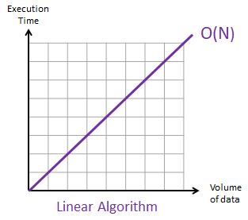
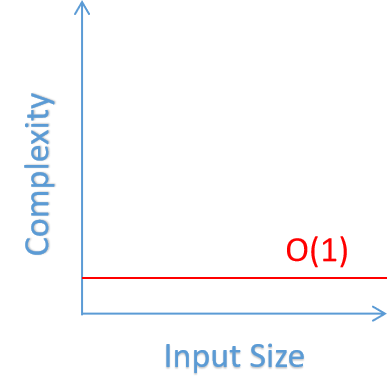
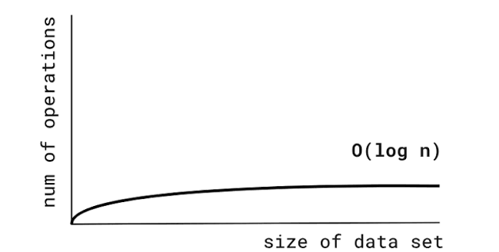

# Big O

- [Big O](#big-o)
    - [What is Big O](#what-is-big-o)
    - [What is Time Complexity](#what-is-time-complexity)
    - [What is Space Complexity](#what-is-space-complexity)
    - [Big O worst case](#big-o-worst-case)
    - [Big O: O(n)](#big-o-on)
    - [Big O: Drop Constants](#big-o-drop-constants)
    - [Big O: O(n^2)](#big-o-on2)
    - [Big O: Drop non Dominants](#big-o-drop-non-dominants)
    - [Big O: O(1)](#big-o-o1)
    - [Big O: O(log n)](#big-o-olog-n)
    - [Big O: different terms for inputs](#big-o-different-terms-for-inputs)
    - [Big O: List](#big-o-list)

> Focused on `O(n^2)` `O(n)` `O(log n)` `O(1)`

> https://www.bigocheatsheet.com/

---

### What is Big O

Big O is a way of comparing two sets of code mathematically and how efficiently they run.

### What is Time Complexity

Time complexity is used to measure how long a piece of code takes to run. It is not measured in time, but in the number of operations it takes to complete something.

### What is Space Complexity

Space complexity is the total amount of memory a piece of code takes to run.

### Big O worst case

When dealing with time and space complexity there are 3 Greek letters we will see: Omega, Theta, and Omicron. Omicron is better known as O, as in Big O.

Example: let's say we have a list of numbers `[1, 2, 3, 4, 5, 6, 7]`

And we're looking for the number `1`. That would be considered our best case scenario, as it will only take one operation.

If we were looking for the number 7, that would be the worst case scenario, as we have to iterate over the entire list to get to it.

The number 4 is the average case.

Best case scenario → Omega Ω

Average case scenario → Theta θ

Worst case scenario → Omicron O

### Big O: O(n)

O(n) means: the amount of work grows in direct proportion to the input size. Double the input, double the work. No more, no less.

```python
def print_items(n):
    for i in range(n):
        print(i)

print_items(10)
```

If `n` has 10 elements, this does roughly 10 units/operations of work. If `n` has 10,000 elements, it does roughly 10,000 units/operations of work. The relationship is linear that's where the name "linear time" comes from, and why it's written `O(n)`: `n` *is* the input size, and the work scales as exactly `n`.

> `O(n)` will always be straight:



### Big O: Drop Constants

```python
def print_items(n):
    for i in range(n):      # runs n times
        print(i)

    for j in range(n):      # runs n times
        print(j)

print_items(10) # 0 1 2 3 4 5 6 7 8 9 0 1 2 3 4 5 6 7 8 9
```

**Count the work:**

- First loop: `n` iterations
- Second loop: `n` iterations
- Total: `n + n` = `2n` steps

So technically, the exact formula for this function's work is `2n`. If `n = 10`, that's 20 print statements.

Now, why do we "drop the constant" and just call this `O(n)` instead of `O(2n)`?

In simple words: Big O only cares about the *shape* of growth, not the exact number of steps. Whether it's `2n` or `n`, both grow in a straight line as `n` grows. Doubling `n` doubles the work either way. The "2" is just a fixed multiplier it never changes the fundamental *pattern* of growth. It doesn't turn linear growth into quadratic or logarithmic growth.

So the rule of thumb is: constants get dropped (2n, 5n, 100n → all just O(n)).

### Big O: O(n^2)

**O(n²)**: work grows proportional to the *square* of the input size. Doubling the input roughly quadruples the work.

```python
for i in range(n):
    for j in range(n):
        # inner loop runs n times, for EACH of the n outer iterations
        # total = n × n = n²
```

**Growth in numbers:**

| n | n² |
| --- | --- |
| 10 | 100 |
| 100 | 10,000 |
| 1,000 | 1,000,000 |

Compare to O(n), where the work just adds up (n + n = 2n, still linear). With O(n²), the work *multiplies* (n × n), so it explodes much faster as input grows. That's why nested loops over the same data are a red flag in interviews: they often signal an inefficient solution.

### Big O: Drop non Dominants

In Big O notation, dropping non-dominant terms means removing smaller, slower-growing parts of a time complexity expression so you only keep the term that grows the fastest as the input size gets very large. Below O(n²), O(n) is a very small percentage of the number of operations, so O(n²) is the dominant one and we just drop the non-dominant O(n).

```python
def print_items(n):
    for i in range(n): # O(n²)
        for j in range(n):
            print(i, j)

#             +

    for k in range(n): # O(n)
        print(k)

print_items(10) # O(n² + n) -> O(n²)
```

### Big O: O(1)

O(1), also called constant time, is the most efficient Big O. The work stays **constant**, no matter how big the input is. Doubling `n` doesn't change anything — it's always "one step" (or a fixed number of steps).

```python
def get_first(arr):
    # always exactly 1 operation, whether arr has 5 or 5 million items
    return arr[0]
```

Whether `arr` is `[1, 2, 3]` or a list of a million numbers, this does the same amount of work: grab index 0 and return it. No loop, no scanning — direct access.

**More examples of O(1):**

```python
def add(a, b):
    return a + b # one operation, regardless of a and b's size

def is_empty(arr):
    return len(arr) == 0 # len() is O(1) in Python — length is stored, not counted

d = {"key": "value"}
def lookup(d, key):
    return d[key] # dict lookup is O(1) on average


def add_items(n):
    return n + n + n

print(add_items(10))
```

| Complexity | As n grows... |
| --- | --- |
| O(1) | work stays flat |
| O(n) | work grows in a straight line |
| O(n²) | work grows in a curve (squared) |



<details>
<summary><code>return n + n + n</code> explanation</summary>

```python
def add_items(n):
    return n + n + n # or n+n+n+n+n+n, however many we write
```

The `n` here is a number's value (like 10), not the size of a collection. In Big O, "n" normally means "how many items are in the input" (length of a list, size of a dict, etc.). But in this function, there's no collection at all — `n` is just one number.

What actually determines the time complexity is: how many operations does the code contain, and does that count change based on input?

If we write:

```python
return n + n + n
```

That's 3 additions. Always 3. Whether we call `add_items(10)` or `add_items(10000000)`, it's still exactly 3 additions, because we *hardcoded* 3 in the source code. The value of `n` changes, but the *number of operations* doesn't.

Now if we write:

```python
return n + n + n + n + n + n
```

That's 6 additions instead of 3. Still constant, still doesn't depend on the *value* of `n`. It's still O(1), just with a bigger fixed multiplier (which, as we learned earlier, we'd drop anyway — O(6) simplifies to O(1), same as O(2n) simplified to O(n)).

</details>

### Big O: O(log n)

O(log n) means: the work grows very slowly — each step cuts the problem in half (or by some fixed fraction) instead of just handling one item at a time.

```python
def count_halvings(n):
    count = 0
    while n > 1:
        n = n // 2 # cut n in half each time
        count += 1
    return count

print(count_halvings(16))
```

Trace it by hand, starting with `n = 16`:

```
n = 16  →  n = 8    (count = 1)
n = 8   →  n = 4    (count = 2)
n = 4   →  n = 2    (count = 3)
n = 2   →  n = 1    (count = 4)
loop stops (n is no longer > 1)
```

The loop ran 4 times. Not 16 times — just 4. Compare that to a normal loop like `for i in range(n)`, which would run all 16 times.

Why only 4 steps? Because each iteration doesn't just move forward by 1, it cuts what's left in half. Going from 16 down to 1 by halving takes way fewer steps than going down by subtracting 1 each time.

Try a bigger number to see the pattern more clearly:

| n | loop iterations |
| --- | --- |
| 16 | 4 |
| 32 | 5 |
| 1,024 | 10 |
| 1,000,000 | ~20 |

Notice: n = 1,000,000 only takes about 20 steps. That's the whole story of O(log n) — the loop count grows *extremely* slowly compared to `n` itself, because dividing in half shrinks things fast.

The line that actually matters here is `n = n // 2` — that's what makes it O(log n) instead of O(n). If it were `n = n - 1` instead, it'd be back to a plain O(n) loop (one step at a time, 16 iterations for n = 16).



> After `O(1)`, `O(log n)` is one of the most efficient Big O

### Big O: different terms for inputs

> For a function with different parameters, you can't simplify it to one variable and call it O(n) — you have to use its parameters' names. Example:

```python
def print_items(a, b):
    for i in range(a): # runs a times
        print(i)

    for j in range(b):  # runs b times
        print(j)

print_items(10, 100) # O(a + b)

def print_items(a, b):
    for i in range(a):
        for j in range(b):
            print(i, j)

print_items(10, 100) # O(a * b)
```

### Big O: List

| Method / Operation | Time Complexity | Why |
| --- | --- | --- |
| `arr[i]` (index access) | O(1) | Direct memory offset — no scanning |
| `arr[i] = x` (index assign) | O(1) | Same reason — direct write |
| `len(arr)` | O(1) | Length is stored, not counted |
| `arr.append(x)` | O(1) amortized | Usually just adds to the end; occasionally Python resizes the underlying array, but that cost averages out over many appends |
| `arr.pop()` (no index, removes last) | O(1) | Just removes the last slot, no shifting |
| `arr.pop(i)` (removes at index i) | O(n) | Everything after index `i` has to shift left by one |
| `arr.insert(i, x)` | O(n) | Everything after index `i` has to shift right by one |
| `x in arr` (membership check) | O(n) | Has to scan through elements one by one until it finds a match (or doesn't) |
| `arr.remove(x)` | O(n) | Has to search for `x` first (O(n)), then shift elements after it |
| `arr.index(x)` | O(n) | Linear scan to find `x` |
| `arr.count(x)` | O(n) | Has to check every element |
| `arr[a:b]` (slicing) | O(k) | Where `k` is the size of the slice — has to copy that many elements |
| `arr.sort()` / `sorted(arr)` | O(n log n) | Python uses Timsort |
| `arr.reverse()` | O(n) | Has to touch every element once |
| `arr + arr2` (concatenation) | O(n + m) | Has to copy both lists into a new one |
| `x in arr` where arr is sorted, using binary search | O(log n) | Only if you manually binary search — `in` itself doesn't do this automatically |

---

Code for these examples lives in [main.py](main.py).
